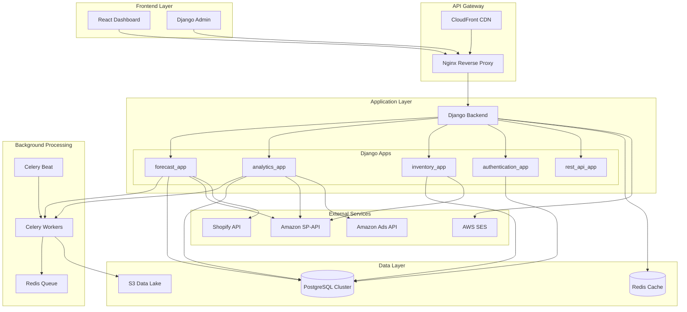
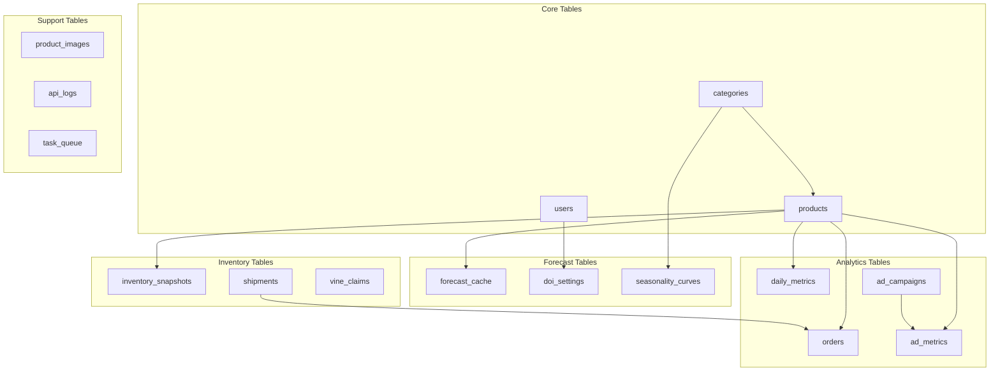
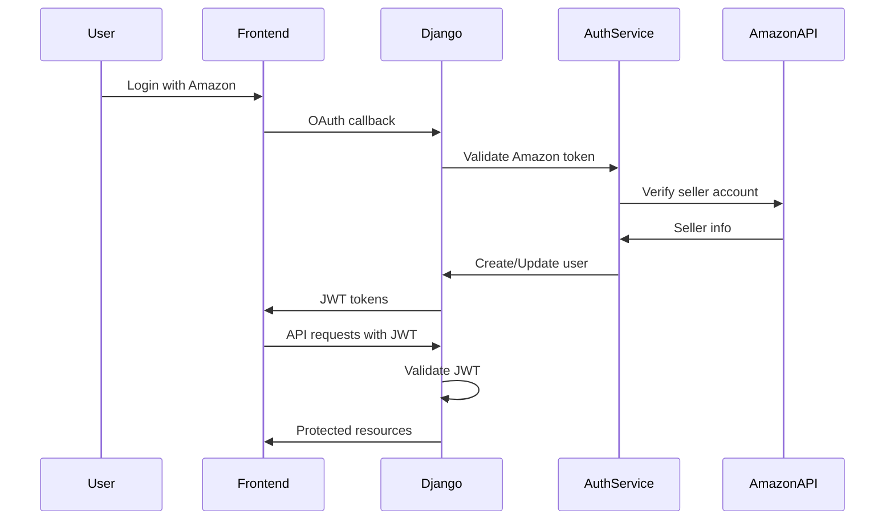
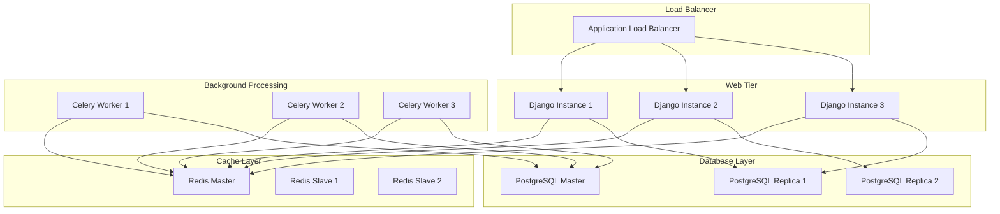

# Comprehensive Backend Architecture & Design

## Overview

This document outlines the architecture for merging two existing Amazon seller analytics platforms into a unified Django-based monorepo system. The consolidation combines:

1. **Forecast System** (C:\Users\User\OneDrive\Desktop\18) - FastAPI-based inventory forecasting
2. **1000 Bananas System** (C:\Users\User\OneDrive\Desktop\The 1000 bananas\The1000backend) - Multi-tier analytics platform

## Executive Summary

**Goal**: Create a professional, scalable Django monorepo that unifies both forecasting and analytics capabilities while maintaining the proven algorithms and data integrity of both systems.

**Key Benefits**:
- Single codebase maintenance
- Unified authentication and authorization
- Shared data models and business logic
- Centralized deployment and monitoring
- Consistent API design patterns
- Enhanced scalability and performance

## System Architecture



## Technology Stack

### Core Framework
- **Django 5.0+** - Primary web framework
- **Django REST Framework** - API development
- **Django Oscar** - E-commerce functionality (if needed)
- **PostgreSQL 15+** - Primary database
- **Redis** - Caching and task queue
- **Celery** - Background task processing

### API & Integration
- **Django REST Framework** - RESTful APIs
- **GraphQL (Graphene)** - Alternative API layer
- **django-cors-headers** - CORS handling
- **requests** - HTTP client for external APIs
- **boto3** - AWS SDK integration

### Data Processing
- **pandas** - Data manipulation
- **numpy** - Numerical computations
- **scikit-learn** - Machine learning (future enhancements)
- **sqlalchemy** - ORM (alternative to Django ORM for complex queries)

### Authentication & Security
- **django-allauth** - Authentication system
- **djangorestframework-simplejwt** - JWT tokens
- **django-ratelimit** - Rate limiting
- **django-axes** - Login attempt monitoring

### Monitoring & Operations
- **django-silk** - Performance profiling
- **sentry-sdk** - Error tracking
- **django-health-check** - Health monitoring
- **whitenoise** - Static file serving

### Development Tools
- **pytest-django** - Testing framework
- **factory-boy** - Test data generation
- **black** - Code formatting
- **mypy** - Type checking
- **pre-commit** - Git hooks

## Django App Architecture

### 1. Authentication & Users (`authentication_app`)

**Purpose**: User management, authentication, and authorization

**Models**:
```python
class User(AbstractUser):
    # Enhanced user model with Amazon seller data
    amazon_seller_id = models.CharField(max_length=100, unique=True)
    marketplace_id = models.CharField(max_length=50)
    subscription_tier = models.CharField(max_length=20)
    timezone = models.CharField(max_length=50, default='UTC')
    
class UserProfile(models.Model):
    user = models.OneToOneField(User, on_delete=models.CASCADE)
    company_name = models.CharField(max_length=200)
    default_doi_goal = models.IntegerField(default=93)
    default_lead_time = models.IntegerField(default=30)
    notification_preferences = models.JSONField(default=dict)
```

**Key Features**:
- Multi-tenant architecture
- Role-based access control (RBAC)
- JWT authentication for API
- Amazon seller account integration
- Subscription management

### 2. Forecast App (`forecast_app`)

**Purpose**: Unified forecasting system combining both legacy algorithms

**Models**:
```python
class Product(models.Model):
    asin = models.CharField(max_length=10, unique=True)
    parent_asin = models.CharField(max_length=10, null=True)
    sku = models.CharField(max_length=50, null=True)
    name = models.CharField(max_length=500)
    release_date = models.DateField()
    category = models.CharField(max_length=100)
    brand = models.CharField(max_length=100)
    is_active = models.BooleanField(default=True)
    
class ForecastCache(models.Model):
    product = models.ForeignKey(Product, on_delete=models.CASCADE)
    algorithm_version = models.CharField(max_length=10)
    forecast_date = models.DateField()
    
    # Forecast results
    units_to_make = models.IntegerField()
    current_doi = models.FloatField()
    runout_date = models.DateField()
    
    # Cumulative data for fast recalculation
    cumulative_data = models.JSONField()  # {30: 100, 60: 220, 90: 350, ...}
    
    # Status and metadata
    status = models.CharField(max_length=20)  # critical, low, good
    calculation_time = models.FloatField()  # seconds
    
    class Meta:
        unique_together = ['product', 'algorithm_version', 'forecast_date']
        indexes = [
            models.Index(fields=['product', 'forecast_date']),
            models.Index(fields=['status']),
        ]

class DOISettings(models.Model):
    user = models.ForeignKey(User, on_delete=models.CASCADE)
    amazon_doi_goal = models.IntegerField(default=93)
    inbound_lead_time = models.IntegerField(default=30)
    manufacture_lead_time = models.IntegerField(default=7)
    market_adjustment = models.FloatField(default=0.05)
    velocity_weight = models.FloatField(default=0.15)
    is_default = models.BooleanField(default=True)
    
class SeasonalityCurve(models.Model):
    category = models.CharField(max_length=100)
    week_of_year = models.IntegerField()
    seasonality_index = models.FloatField()
    data_source = models.CharField(max_length=50)  # search_volume, sales, etc.
```

**Algorithm Implementation**:
```python
# app/forecast_app/algorithms/
class BaseForecastAlgorithm(ABC):
    """Base class for all forecasting algorithms"""
    
    @abstractmethod
    def calculate(self, product: Product, settings: DOISettings) -> ForecastResult:
        pass
    
    @abstractmethod
    def get_algorithm_type(self) -> str:
        pass

class NewProductAlgorithm(BaseForecastAlgorithm):
    """0-6 months: Peak-based forecasting with seasonality"""
    
    def calculate(self, product: Product, settings: DOISettings) -> ForecastResult:
        # Implementation from forecast_0_6m.py
        pass

class GrowingProductAlgorithm(BaseForecastAlgorithm):
    """6-18 months: CVR-based forecasting"""
    
    def calculate(self, product: Product, settings: DOISettings) -> ForecastResult:
        # Implementation from forecast_6_18m.py
        pass

class MatureProductAlgorithm(BaseForecastAlgorithm):
    """18+ months: Prior year comparison with smoothing"""
    
    def calculate(self, product: Product, settings: DOISettings) -> ForecastResult:
        # Implementation from forecast_18m_plus.py
        pass

class ForecastStrategy:
    """Strategy pattern for algorithm selection"""
    
    def get_algorithm(self, product: Product) -> BaseForecastAlgorithm:
        age_months = self._calculate_product_age(product)
        
        if age_months <= 6:
            return NewProductAlgorithm()
        elif age_months <= 18:
            return GrowingProductAlgorithm()
        else:
            return MatureProductAlgorithm()
```

**Key Features**:
- Unified algorithm selection based on product age
- Caching system for instant recalculation
- DOI settings management
- Cumulative forecast data for fast recalculation
- Algorithm versioning and A/B testing support

### 3. Analytics App (`analytics_app`)

**Purpose**: Comprehensive analytics and reporting system

**Models**:
```python
class DailyMetrics(models.Model):
    """Pre-aggregated daily metrics for fast queries"""
    product = models.ForeignKey(Product, on_delete=models.CASCADE)
    date = models.DateField()
    
    # Sales metrics
    units_sold = models.IntegerField(default=0)
    revenue = models.DecimalField(max_digits=10, decimal_places=2, default=0)
    orders = models.IntegerField(default=0)
    
    # Traffic metrics
    sessions = models.IntegerField(default=0)
    page_views = models.IntegerField(default=0)
    conversion_rate = models.FloatField(default=0)
    
    # Advertising metrics
    ad_spend = models.DecimalField(max_digits=10, decimal_places=2, default=0)
    ad_sales = models.DecimalField(max_digits=10, decimal_places=2, default=0)
    ad_clicks = models.IntegerField(default=0)
    ad_impressions = models.IntegerField(default=0)
    
    # Calculated metrics
    acos = models.FloatField(default=0)  # Ad spend / Ad sales
    tacos = models.FloatField(default=0)  # Ad spend / Total sales
    roas = models.FloatField(default=0)  # Ad sales / Ad spend
    
    class Meta:
        unique_together = ['product', 'date']
        indexes = [
            models.Index(fields=['product', 'date']),
            models.Index(fields=['date']),
        ]

class Order(models.Model):
    """Enhanced order tracking"""
    amazon_order_id = models.CharField(max_length=50, unique=True)
    product = models.ForeignKey(Product, on_delete=models.CASCADE)
    purchase_date = models.DateTimeField()
    units = models.IntegerField()
    revenue = models.DecimalField(max_digits=10, decimal_places=2)
    
    # Fulfillment details
    fulfillment_channel = models.CharField(max_length=20)
    ship_service_level = models.CharField(max_length=50)
    
    # Customer info
    customer_state = models.CharField(max_length=50, null=True)
    customer_country = models.CharField(max_length=50, null=True)

class AdCampaign(models.Model):
    """Advertising campaign tracking"""
    campaign_id = models.CharField(max_length=50, unique=True)
    name = models.CharField(max_length=200)
    campaign_type = models.CharField(max_length=20)
    targeting_type = models.CharField(max_length=20)
    daily_budget = models.DecimalField(max_digits=10, decimal_places=2)
    state = models.CharField(max_length=20)
    
class AdMetric(models.Model):
    """Granular advertising metrics"""
    campaign = models.ForeignKey(AdCampaign, on_delete=models.CASCADE)
    product = models.ForeignKey(Product, on_delete=models.CASCADE)
    date = models.DateField()
    
    # Performance metrics
    impressions = models.IntegerField(default=0)
    clicks = models.IntegerField(default=0)
    cost = models.DecimalField(max_digits=10, decimal_places=2, default=0)
    attributed_sales = models.DecimalField(max_digits=10, decimal_places=2, default=0)
    attributed_units = models.IntegerField(default=0)
    
class Category(models.Model):
    """Product categorization system"""
    name = models.CharField(max_length=100, unique=True)
    parent = models.ForeignKey('self', null=True, on_delete=models.CASCADE)
    amazon_category_id = models.CharField(max_length=50, null=True)
```

**Key Features**:
- Pre-aggregated daily metrics for fast dashboard queries
- Comprehensive advertising campaign tracking
- Advanced categorization system
- Multi-dimensional analytics capabilities

### 4. Inventory App (`inventory_app`)

**Purpose**: Inventory management and tracking

**Models**:
```python
class InventorySnapshot(models.Model):
    """Real-time inventory tracking"""
    product = models.ForeignKey(Product, on_delete=models.CASCADE)
    snapshot_date = models.DateTimeField()
    
    # FBA Inventory
    fba_available = models.IntegerField(default=0)
    fba_reserved = models.IntegerField(default=0)
    fba_inbound = models.IntegerField(default=0)
    
    # AWD Inventory
    awd_available = models.IntegerField(default=0)
    awd_reserved = models.IntegerField(default=0)
    awd_inbound = models.IntegerField(default=0)
    
    # Calculated totals
    total_available = models.IntegerField(default=0)
    total_reserved = models.IntegerField(default=0)
    total_inbound = models.IntegerField(default=0)
    
    class Meta:
        unique_together = ['product', 'snapshot_date']
        indexes = [
            models.Index(fields=['product', 'snapshot_date']),
        ]

class Shipment(models.Model):
    """Inbound shipment tracking"""
    shipment_id = models.CharField(max_length=50, unique=True)
    products = models.ManyToManyField(Product, through='ShipmentItem')
    
    # Shipment details
    shipment_name = models.CharField(max_length=200)
    shipment_status = models.CharField(max_length=50)
    
    # Dates
    creation_date = models.DateTimeField()
    estimated_arrival = models.DateField(null=True)
    actual_arrival = models.DateField(null=True)
    
    # Quantities
    total_units = models.IntegerField()
    received_units = models.IntegerField(default=0)
    
class ShipmentItem(models.Model):
    """Individual items within shipments"""
    shipment = models.ForeignKey(Shipment, on_delete=models.CASCADE)
    product = models.ForeignKey(Product, on_delete=models.CASCADE)
    quantity_shipped = models.IntegerField()
    quantity_received = models.IntegerField(default=0)
    quantity_expected = models.IntegerField()

class VineClaim(models.Model):
    """Amazon Vine program tracking"""
    product = models.ForeignKey(Product, on_delete=models.CASCADE)
    claim_date = models.DateField()
    units_claimed = models.IntegerField()
    vine_club = models.CharField(max_length=50)
```

### 5. REST API App (`rest_api_app`)

**Purpose**: Centralized API endpoints and GraphQL schema

**Key Endpoints**:
```python
# Unified API combining both legacy systems

# Forecast endpoints
GET /api/v1/forecast/{asin}/
GET /api/v1/forecast/bulk/
POST /api/v1/forecast/recalculate/
GET /api/v1/forecast/chart/{asin}/

# Analytics endpoints  
GET /api/v1/analytics/metrics/
GET /api/v1/analytics/products/
GET /api/v1/analytics/categories/
GET /api/v1/analytics/ads/

# Inventory endpoints
GET /api/v1/inventory/current/
GET /api/v1/inventory/shipments/
GET /api/v1/inventory/history/

# Planning endpoints
GET /api/v1/planning/table/
GET /api/v1/planning/recommendations/
POST /api/v1/planning/settings/

# GraphQL endpoint
POST /api/v1/graphql/
```

## Database Design

### PostgreSQL Schema Architecture



### Database Optimization Strategies

1. **Partitioning**: Partition large tables by date (daily_metrics, inventory_snapshots)
2. **Indexes**: Strategic indexing on foreign keys and frequently queried fields
3. **Materialized Views**: Pre-aggregated metrics for dashboard queries
4. **Connection Pooling**: PgBouncer for connection management
5. **Read Replicas**: Separate read and write operations

## Background Processing Architecture

### Celery Task Structure

```python
# tasks.py
from celery import shared_task
from django.core.cache import cache

@shared_task(bind=True, max_retries=3)
def update_forecast_cache(self, product_id):
    """Update forecast cache for a single product"""
    try:
        product = Product.objects.get(id=product_id)
        strategy = ForecastStrategy()
        algorithm = strategy.get_algorithm(product)
        
        result = algorithm.calculate(product)
        
        # Update cache
        ForecastCache.objects.update_or_create(
            product=product,
            algorithm_version=result.version,
            forecast_date=date.today(),
            defaults={
                'units_to_make': result.units_to_make,
                'current_doi': result.current_doi,
                'cumulative_data': result.cumulative_data,
                'status': result.status,
                'calculation_time': result.calculation_time
            }
        )
        
        # Invalidate related caches
        cache.delete(f'forecast_{product.asin}')
        
    except Exception as exc:
        logger.error(f"Forecast update failed for product {product_id}: {exc}")
        raise self.retry(exc=exc, countdown=60)

@shared_task
def bulk_forecast_update():
    """Update forecasts for all active products"""
    active_products = Product.objects.filter(is_active=True)
    
    # Use chord for parallel processing
    job = group(
        update_forecast_cache.s(product.id) 
        for product in active_products
    )
    
    return job.apply_async()

@shared_task
def sync_amazon_data():
    """Sync data from Amazon APIs"""
    sync_spapi_data.delay()
    sync_ads_data.delay()
    update_inventory_snapshots.delay()

@shared_task
def generate_daily_metrics():
    """Generate pre-aggregated daily metrics"""
    yesterday = date.today() - timedelta(days=1)
    
    # Aggregate from raw data
    DailyMetrics.objects.generate_for_date(yesterday)
    
    # Update materialized views
    refresh_materialized_views.delay()
```

### Scheduled Tasks (Celery Beat)

```python
# celerybeat_schedule.py
from celery.schedules import crontab

beat_schedule = {
    'update-forecasts': {
        'task': 'forecast_app.tasks.bulk_forecast_update',
        'schedule': crontab(hour=2, minute=0),  # 2 AM daily
    },
    'sync-amazon-data': {
        'task': 'analytics_app.tasks.sync_amazon_data',
        'schedule': crontab(hour=1, minute=0),  # 1 AM daily
    },
    'generate-daily-metrics': {
        'task': 'analytics_app.tasks.generate_daily_metrics',
        'schedule': crontab(hour=3, minute=0),  # 3 AM daily
    },
    'cleanup-old-data': {
        'task': 'core.tasks.cleanup_old_data',
        'schedule': crontab(hour=4, minute=0, day_of_week=0),  # Weekly
    },
    'refresh-cache': {
        'task': 'core.tasks.refresh_cache',
        'schedule': crontab(minute='*/30'),  # Every 30 minutes
    },
}
```

## External API Integration

### Amazon SP-API Integration

```python
# services/amazon_spapi.py
class AmazonSPAPIClient:
    """Enhanced SP-API client with rate limiting and caching"""
    
    def __init__(self):
        self.client_id = settings.SP_API_CLIENT_ID
        self.client_secret = settings.SP_API_CLIENT_SECRET
        self.refresh_token = settings.SP_API_REFRESH_TOKEN
        self.access_token = None
        self.token_expires = None
    
    @retry(stop=stop_after_attempt(3), wait=wait_exponential(multiplier=1, min=4, max=10))
    @rate_limit(calls=10, period=60)  # 10 calls per minute
    def get_inventory(self, seller_id, marketplace_id):
        """Get inventory data with rate limiting"""
        
        # Check cache first
        cache_key = f'inventory_{seller_id}_{marketplace_id}'
        cached_data = cache.get(cache_key)
        if cached_data:
            return cached_data
        
        # Make API call
        headers = self._get_auth_headers()
        response = requests.get(
            f'{self.base_url}/fba/inventory/v1/summaries',
            headers=headers,
            params={'details': True, 'marketplaceIds': marketplace_id}
        )
        
        if response.status_code == 200:
            data = response.json()
            # Cache for 15 minutes
            cache.set(cache_key, data, 900)
            return data
        else:
            raise APIException(f"SP-API error: {response.status_code}")
    
    def sync_product_catalog(self, seller_id):
        """Sync entire product catalog"""
        
        # Get all items
        items = self._get_catalog_items(seller_id)
        
        # Process in batches
        batch_size = 100
        for i in range(0, len(items), batch_size):
            batch = items[i:i + batch_size]
            self._process_catalog_batch.delay(batch)
```

### Shopify Integration

```python
# services/shopify.py
class ShopifyService:
    """Shopify integration for product images"""
    
    def __init__(self):
        self.store_domain = settings.SHOPIFY_STORE_DOMAIN
        self.storefront_token = settings.SHOPIFY_STOREFRONT_TOKEN
        self.graphql_url = f'https://{self.store_domain}/api/2023-10/graphql.json'
    
    def search_product_images(self, product_name):
        """Search for product images by name"""
        
        query = '''
        query searchProducts($query: String!) {
            products(first: 10, query: $query) {
                edges {
                    node {
                        id
                        title
                        featuredImage {
                            url
                            altText
                        }
                        images(first: 5) {
                            edges {
                                node {
                                    url
                                    altText
                                }
                            }
                        }
                    }
                }
            }
        }
        '''
        
        response = requests.post(
            self.graphql_url,
            json={
                'query': query,
                'variables': {'query': product_name}
            },
            headers={'X-Shopify-Storefront-Access-Token': self.storefront_token}
        )
        
        return response.json()
    
    def match_product_to_image(self, product):
        """Intelligently match Amazon product to Shopify image"""
        
        # Try exact name match
        results = self.search_product_images(product.name)
        
        if results['data']['products']['edges']:
            # Return best match
            return self._select_best_image(results)
        
        # Try variations of the name
        variations = self._generate_name_variations(product.name)
        for variation in variations:
            results = self.search_product_images(variation)
            if results['data']['products']['edges']:
                return self._select_best_image(results)
        
        return None
```

## API Design

### RESTful API Standards

All APIs follow consistent standards:

1. **Versioning**: `/api/v1/` prefix
2. **HTTP Methods**: Proper use of GET, POST, PUT, DELETE
3. **Status Codes**: Standard HTTP status codes
4. **Pagination**: Cursor-based pagination for large datasets
5. **Filtering**: Query parameter based filtering
6. **Sorting**: Sort parameter with field and direction
7. **Rate Limiting**: Per-user rate limiting

### GraphQL Schema

```graphql
type Product {
  id: ID!
  asin: String!
  name: String!
  category: Category
  releaseDate: Date!
  
  # Forecast data
  forecast: Forecast
  inventory: Inventory
  
  # Analytics
  metrics(startDate: Date!, endDate: Date!): [DailyMetrics!]!
  orders(limit: Int = 10): [Order!]!
  adsPerformance: AdPerformance
  
  # Images
  images: [ProductImage!]!
}

type Forecast {
  unitsToMake: Int!
  currentDio: Float!
  runoutDate: Date!
  status: ForecastStatus!
  cumulativeData: JSON!
  algorithm: String!
  calculatedAt: DateTime!
}

type DailyMetrics {
  date: Date!
  unitsSold: Int!
  revenue: Float!
  sessions: Int!
  conversionRate: Float!
  acos: Float!
  tacos: Float!
  roas: Float!
}

type Query {
  # Product queries
  product(asin: String!): Product
  products(
    category: String
    status: String
    limit: Int = 20
    offset: Int = 0
  ): ProductConnection!
  
  # Forecast queries
  forecast(asin: String!): Forecast
  forecasts(status: ForecastStatus): [Forecast!]!
  
  # Analytics queries
  metrics(
    asins: [String!]!
    startDate: Date!
    endDate: Date!
  ): [DailyMetrics!]!
  
  # Planning queries
  planningTable: PlanningTable!
  recommendations: [Recommendation!]!
}

mutation {
  # Settings mutations
  updateDioSettings(input: DOISettingsInput!): DOISettings!
  
  # Cache mutations
  refreshForecastCache(asin: String!): Boolean!
  refreshAllCaches: Boolean!
  
  # Data sync mutations
  triggerAmazonSync: Boolean!
  triggerForecastRecalculation: Boolean!
}
```

## Security Architecture

### Authentication Flow



### Security Measures

1. **JWT Authentication**: Stateless authentication with refresh tokens
2. **Rate Limiting**: Per-user and per-IP rate limiting
3. **CORS**: Strict CORS policy for API endpoints
4. **Input Validation**: Comprehensive input validation and sanitization
5. **SQL Injection Prevention**: Parameterized queries and ORM usage
6. **XSS Prevention**: Template auto-escaping and CSP headers
7. **CSRF Protection**: Django's built-in CSRF protection
8. **Data Encryption**: Encryption for sensitive data at rest
9. **Audit Logging**: Comprehensive audit trail for all operations
10. **API Key Management**: Secure API key storage and rotation

## Scalability Architecture

### Horizontal Scaling Strategy



### Performance Optimization

1. **Database Optimization**:
   - Strategic indexing
   - Query optimization
   - Connection pooling
   - Read/write splitting

2. **Caching Strategy**:
   - Redis for session storage
   - Database query result caching
   - API response caching
   - Full-page caching for anonymous users

3. **CDN Integration**:
   - Static file serving
   - API response caching
   - Geographic distribution

4. **Async Processing**:
   - Celery for background tasks
   - WebSocket support for real-time updates
   - Async file uploads

## Deployment Architecture

### Docker Architecture

```dockerfile
# Dockerfile
FROM python:3.12-slim

ENV PYTHONDONTWRITEBYTECODE=1 \
    PYTHONUNBUFFERED=1

WORKDIR /app

# Install system dependencies
RUN apt-get update && apt-get install -y \
    build-essential \
    libpq-dev \
    netcat-traditional \
    && rm -rf /var/lib/apt/lists/*

# Install Python dependencies
COPY requirements.txt .
RUN pip install --no-cache-dir -r requirements.txt

# Copy application code
COPY . .

# Create non-root user
RUN useradd -m -u 1000 appuser && chown -R appuser:appuser /app
USER appuser

# Health check
HEALTHCHECK --interval=30s --timeout=30s --start-period=5s --retries=3 \
    CMD python -c "import requests; requests.get('http://localhost:8000/health/', timeout=10)"

CMD ["gunicorn", "--bind", "0.0.0.0:8000", "--workers", "4", "config.wsgi:application"]
```

### Docker Compose Configuration

```yaml
# docker-compose.yml
version: '3.8'

services:
  web:
    build: .
    ports:
      - "8000:8000"
    environment:
      - DATABASE_URL=postgresql://user:pass@db:5432/mvp3
      - REDIS_URL=redis://redis:6379/0
      - SECRET_KEY=${SECRET_KEY}
    depends_on:
      - db
      - redis
    volumes:
      - static_volume:/app/staticfiles
      - media_volume:/app/mediafiles
    command: >
      sh -c "python manage.py migrate &&
             python manage.py collectstatic --noinput &&
             gunicorn config.wsgi:application --bind 0.0.0.0:8000"

  celery:
    build: .
    environment:
      - DATABASE_URL=postgresql://user:pass@db:5432/mvp3
      - REDIS_URL=redis://redis:6379/0
    depends_on:
      - db
      - redis
    command: celery -A config worker -l info
    
  celery-beat:
    build: .
    environment:
      - DATABASE_URL=postgresql://user:pass@db:5432/mvp3
      - REDIS_URL=redis://redis:6379/0
    depends_on:
      - db
      - redis
    command: celery -A config beat -l info

  db:
    image: postgres:15
    environment:
      - POSTGRES_DB=mvp3
      - POSTGRES_USER=user
      - POSTGRES_PASSWORD=pass
    volumes:
      - postgres_data:/var/lib/postgresql/data
    ports:
      - "5432:5432"

  redis:
    image: redis:7-alpine
    ports:
      - "6379:6379"

  nginx:
    image: nginx:alpine
    ports:
      - "80:80"
      - "443:443"
    volumes:
      - ./nginx.conf:/etc/nginx/nginx.conf
      - static_volume:/app/staticfiles
      - media_volume:/app/mediafiles
    depends_on:
      - web

volumes:
  postgres_data:
  static_volume:
  media_volume:
```

### AWS Infrastructure

```mermaid
graph TB
    subgraph "Route 53"
        DNS[DNS Management]
    end
    
    subgraph "CloudFront"
        CDN[CDN Distribution]
    end
    
    subgraph "ALB"
        ALB[Application Load Balancer]
    end
    
    subgraph "ECS Cluster"
        subgraph "ECS Service - Web"
            WEB1[Django Container]
            WEB2[Django Container]
            WEB3[Django Container]
        end
        
        subgraph "ECS Service - Celery"
            WORKER1[Celery Worker]
            WORKER2[Celery Worker]
        end
    end
    
    subgraph "RDS"
        RDS[PostgreSQL Multi-AZ]
    end
    
    subgraph "ElastiCache"
        REDIS[Redis Cluster]
    end
    
    subgraph "S3"
        STATIC[Static Files]
        MEDIA[Media Files]
        BACKUP[Database Backups]
    end
    
    DNS --> CDN
    CDN --> ALB
    ALB --> WEB1
    ALB --> WEB2
    ALB --> WEB3
    
    WEB1 --> RDS
    WEB2 --> RDS
    WEB3 --> RDS
    
    WEB1 --> REDIS
    WEB2 --> REDIS
    WEB3 --> REDIS
    
    WEB1 --> STATIC
    WEB2 --> STATIC
    WEB3 --> STATIC
    
    WORKER1 --> RDS
    WORKER2 --> RDS
    WORKER1 --> REDIS
    WORKER2 --> REDIS
    
    RDS --> BACKUP
```

## Monitoring and Observability

### Application Monitoring

```python
# monitoring/middleware.py
class PerformanceMonitoringMiddleware:
    """Monitor API performance and log slow requests"""
    
    def __init__(self, get_response):
        self.get_response = get_response
        self.slow_request_threshold = 1.0  # seconds
    
    def __call__(self, request):
        start_time = time.time()
        response = self.get_response(request)
        duration = time.time() - start_time
        
        # Log slow requests
        if duration > self.slow_request_threshold:
            logger.warning(
                f"Slow request: {request.method} {request.path} "
                f"took {duration:.2f}s"
            )
            
            # Send to Sentry
            with sentry_sdk.push_scope() as scope:
                scope.set_tag('slow_request', True)
                scope.set_context('request', {
                    'method': request.method,
                    'path': request.path,
                    'duration': duration,
                    'user': str(request.user)
                })
                sentry_sdk.capture_message("Slow API request")
        
        # Add performance header
        response['X-Response-Time'] = f'{duration:.3f}s'
        
        return response

# monitoring/health_checks.py
class DatabaseHealthCheck(BaseHealthCheckBackend):
    """Check database connectivity"""
    
    def check_status(self):
        try:
            Product.objects.count()
            return HealthCheckPassed()
        except Exception as e:
            return HealthCheckFailed(str(e))

class CacheHealthCheck(BaseHealthCheckBackend):
    """Check Redis cache connectivity"""
    
    def check_status(self):
        try:
            cache.set('health_check', 'ok', 30)
            value = cache.get('health_check')
            if value == 'ok':
                return HealthCheckPassed()
            else:
                return HealthCheckFailed("Cache value mismatch")
        except Exception as e:
            return HealthCheckFailed(str(e))
```

### Metrics and Alerting

```python
# monitoring/metrics.py
from prometheus_client import Counter, Histogram, Gauge

# API metrics
api_requests_total = Counter(
    'api_requests_total',
    'Total API requests',
    ['method', 'endpoint', 'status']
)

api_request_duration = Histogram(
    'api_request_duration_seconds',
    'API request duration',
    ['method', 'endpoint']
)

# Business metrics
forecast_cache_hits = Counter(
    'forecast_cache_hits_total',
    'Forecast cache hits',
    ['algorithm']
)

forecast_calculation_time = Histogram(
    'forecast_calculation_seconds',
    'Time to calculate forecast',
    ['algorithm']
)

# System metrics
active_users = Gauge(
    'active_users_total',
    'Number of active users'
)

database_connections = Gauge(
    'database_connections_total',
    'Number of database connections'
)

# middleware.py
class MetricsMiddleware:
    """Collect Prometheus metrics"""
    
    def __init__(self, get_response):
        self.get_response = get_response
    
    def __call__(self, request):
        start_time = time.time()
        
        response = self.get_response(request)
        
        duration = time.time() - start_time
        
        # Record metrics
        api_requests_total.labels(
            method=request.method,
            endpoint=request.path,
            status=response.status_code
        ).inc()
        
        api_request_duration.labels(
            method=request.method,
            endpoint=request.path
        ).observe(duration)
        
        return response
```

## Testing Strategy

### Test Architecture

```python
# tests/conftest.py
@pytest.fixture
def user():
    return UserFactory()

@pytest.fixture
def product():
    return ProductFactory()

@pytest.fixture
def api_client():
    return APIClient()

@pytest.fixture
def authenticated_client(api_client, user):
    api_client.force_authenticate(user=user)
    return api_client

# tests/test_forecast.py
class TestForecastAPI:
    
    def test_single_product_forecast(self, authenticated_client, product):
        """Test single product forecast endpoint"""
        url = reverse('forecast-detail', kwargs={'asin': product.asin})
        response = authenticated_client.get(url)
        
        assert response.status_code == status.HTTP_200_OK
        assert 'units_to_make' in response.data
        assert 'current_doi' in response.data
        assert 'status' in response.data
    
    def test_bulk_forecast(self, authenticated_client):
        """Test bulk forecast endpoint"""
        ProductFactory.create_batch(10)
        
        url = reverse('forecast-bulk')
        response = authenticated_client.get(url)
        
        assert response.status_code == status.HTTP_200_OK
        assert len(response.data['results']) == 10
    
    def test_doi_recalculation(self, authenticated_client, product):
        """Test DOI recalculation with new settings"""
        url = reverse('forecast-recalculate-doi')
        data = {
            'amazon_doi_goal': 120,
            'inbound_lead_time': 45,
            'manufacture_lead_time': 14
        }
        
        response = authenticated_client.post(url, data)
        
        assert response.status_code == status.HTTP_200_OK
        assert response.data['recalculated_products'] > 0

# tests/test_algorithms.py
class TestForecastAlgorithms:
    
    @pytest.mark.parametrize('age_months,expected_algorithm', [
        (3, NewProductAlgorithm),
        (12, GrowingProductAlgorithm),
        (24, MatureProductAlgorithm)
    ])
    def test_algorithm_selection(self, age_months, expected_algorithm):
        """Test algorithm selection based on product age"""
        product = ProductFactory(release_date=date.today() - timedelta(days=age_months*30))
        strategy = ForecastStrategy()
        
        algorithm = strategy.get_algorithm(product)
        
        assert isinstance(algorithm, expected_algorithm)
    
    def test_new_product_algorithm(self):
        """Test new product algorithm logic"""
        product = ProductFactory(release_date=date.today() - timedelta(days=90))
        algorithm = NewProductAlgorithm()
        
        result = algorithm.calculate(product)
        
        assert result.units_to_make >= 0
        assert result.current_doi > 0
        assert 'cumulative_data' in result.additional_data
```

### Load Testing

```python
# tests/load_test.py
from locust import HttpUser, task, between

class APIUser(HttpUser):
    wait_time = between(1, 3)
    
    def on_start(self):
        # Login and get token
        response = self.client.post('/api/v1/auth/login/', json={
            'username': 'testuser',
            'password': 'testpass'
        })
        self.token = response.json()['access']
    
    @task(3)
    def get_forecast(self):
        """Test forecast endpoint"""
        headers = {'Authorization': f'Bearer {self.token}'}
        self.client.get('/api/v1/forecast/B08N5WRWNW/', headers=headers)
    
    @task(2)
    def get_analytics(self):
        """Test analytics endpoint"""
        headers = {'Authorization': f'Bearer {self.token}'}
        self.client.get('/api/v1/analytics/metrics/?date=2024-01-01', headers=headers)
    
    @task(1)
    def get_planning_table(self):
        """Test planning table endpoint"""
        headers = {'Authorization': f'Bearer {self.token}'}
        self.client.get('/api/v1/planning/table/', headers=headers)
```

## Migration Strategy

### Data Migration Plan

```python
# migrations/data_migration.py
class DataMigration:
    """Migrate data from legacy systems to new Django system"""
    
    def __init__(self):
        self.forecast_db = self.connect_to_forecast_system()
        self.bananas_db = self.connect_to_bananas_system()
    
    def migrate_products(self):
        """Migrate product data from both systems"""
        
        # Get products from forecast system
        forecast_products = self.forecast_db.query("""
            SELECT asin, parent_asin, product_name, release_date, category
            FROM products
        """)
        
        # Get products from bananas system
        bananas_products = self.bananas_db.query("""
            SELECT asin, sku, product_name, release_date, brand, category
            FROM products
        """)
        
        # Merge and deduplicate
        merged_products = self.merge_product_data(forecast_products, bananas_products)
        
        # Create Django objects
        for product_data in merged_products:
            Product.objects.get_or_create(
                asin=product_data['asin'],
                defaults={
                    'parent_asin': product_data.get('parent_asin'),
                    'sku': product_data.get('sku'),
                    'name': product_data['product_name'],
                    'release_date': product_data['release_date'],
                    'brand': product_data.get('brand'),
                    'category': product_data.get('category')
                }
            )
    
    def migrate_historical_data(self):
        """Migrate historical sales and inventory data"""
        
        # Migrate sales data
        self.migrate_sales_data()
        
        # Migrate inventory data
        self.migrate_inventory_data()
        
        # Migrate advertising data
        self.migrate_advertising_data()
    
    def migrate_forecasts(self):
        """Migrate existing forecast cache"""
        
        # Get forecast cache from forecast system
        forecast_cache = self.forecast_db.query("""
            SELECT asin, forecast_date, units_to_make, current_doi, 
                   cumulative_data, status, algorithm_version
            FROM forecast_cache
        """)
        
        # Create Django objects
        for cache_data in forecast_cache:
            product = Product.objects.get(asin=cache_data['asin'])
            
            ForecastCache.objects.get_or_create(
                product=product,
                algorithm_version=cache_data['algorithm_version'],
                forecast_date=cache_data['forecast_date'],
                defaults={
                    'units_to_make': cache_data['units_to_make'],
                    'current_doi': cache_data['current_doi'],
                    'cumulative_data': cache_data['cumulative_data'],
                    'status': cache_data['status']
                }
            )
    
    def validate_migration(self):
        """Validate that migration was successful"""
        
        # Check product counts
        forecast_count = self.forecast_db.query("SELECT COUNT(*) FROM products")[0][0]
        bananas_count = self.bananas_db.query("SELECT COUNT(*) FROM products")[0][0]
        django_count = Product.objects.count()
        
        logger.info(f"Products migrated: {django_count} (Forecast: {forecast_count}, Bananas: {bananas_count})")
        
        # Check data integrity
        self.check_data_integrity()
        
        # Run algorithm comparisons
        self.compare_forecast_results()
```

### Zero-Downtime Deployment

```python
# deployment/zero_downtime.py
class ZeroDowntimeDeployment:
    """Implement blue-green deployment strategy"""
    
    def deploy_new_version(self):
        """Deploy new version with zero downtime"""
        
        # Step 1: Deploy to staging environment
        self.deploy_to_staging()
        
        # Step 2: Run comprehensive tests
        self.run_integration_tests()
        self.run_performance_tests()
        
        # Step 3: Sync data (if needed)
        self.sync_latest_data()
        
        # Step 4: Switch traffic gradually
        self.gradual_traffic_switch()
        
        # Step 5: Monitor and validate
        self.monitor_deployment()
        
        # Step 6: Complete cutover or rollback
        if self.deployment_is_healthy():
            self.complete_cutover()
        else:
            self.rollback()
```

## Maintenance and Operations

### Database Maintenance

```python
# maintenance/db_maintenance.py
class DatabaseMaintenance:
    """Automated database maintenance tasks"""
    
    @shared_task
def cleanup_old_data():
    """Clean up old data according to retention policy"""
        
        # Remove old forecasts (keep 2 years)
        cutoff_date = date.today() - timedelta(days=730)
        ForecastCache.objects.filter(forecast_date__lt=cutoff_date).delete()
        
        # Archive old metrics
        archive_date = date.today() - timedelta(days=365)
        old_metrics = DailyMetrics.objects.filter(date__lt=archive_date)
        
        # Export to S3 before deletion
        self.archive_to_s3(old_metrics)
        old_metrics.delete()
        
        # Vacuum and analyze
        with connection.cursor() as cursor:
            cursor.execute("VACUUM ANALYZE")
    
    @shared_task
    def refresh_materialized_views():
        """Refresh materialized views for dashboard performance"""
        
        with connection.cursor() as cursor:
            cursor.execute("""
                REFRESH MATERIALIZED VIEW CONCURRENTLY 
                monthly_sales_summary
            """)
            
            cursor.execute("""
                REFRESH MATERIALIZED VIEW CONCURRENTLY 
                product_performance_metrics
            """)
    
    @shared_task
    def update_table_statistics():
        """Update table statistics for query optimization"""
        
        tables = [
            'products', 'forecast_cache', 'daily_metrics',
            'inventory_snapshots', 'orders', 'ad_metrics'
        ]
        
        with connection.cursor() as cursor:
            for table in tables:
                cursor.execute(f"ANALYZE {table}")
```

### Backup Strategy

```python
# maintenance/backup.py
class BackupManager:
    """Automated backup system"""
    
    @shared_task
    def create_database_backup():
        """Create database backup and upload to S3"""
        
        timestamp = datetime.now().strftime('%Y%m%d_%H%M%S')
        backup_file = f'backup_{timestamp}.sql.gz'
        
        # Create backup
        command = f"""
        PGPASSWORD={settings.DATABASES['default']['PASSWORD']} 
        pg_dump -h {settings.DATABASES['default']['HOST']} 
                -U {settings.DATABASES['default']['USER']} 
                -d {settings.DATABASES['default']['NAME']} 
                --no-owner --no-acl 
        | gzip > {backup_file}
        """
        
        subprocess.run(command, shell=True, check=True)
        
        # Upload to S3
        s3_client = boto3.client('s3')
        s3_client.upload_file(
            backup_file,
            settings.BACKUP_BUCKET,
            f'database/{backup_file}'
        )
        
        # Clean up local file
        os.remove(backup_file)
        
        # Verify backup integrity
        self.verify_backup(backup_file)
```

This comprehensive architecture document provides a complete blueprint for building a professional Django-based monorepo that unifies both forecasting and analytics capabilities. The design maintains backward compatibility while providing a scalable, maintainable, and secure platform for Amazon seller analytics.